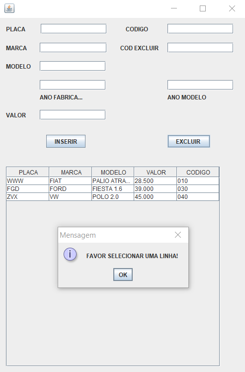

# CadastroVeiculos
Data structure

## Sobre

Este e um projeto desenvolvido para o cadastro de clientes em uma agencia de veículos. Onde é possível a inclusão e exclusão de dados cadastrais, e a apresentação
destes dados em um painel com uma tabela.

## Informações

As demais implementações que constam no código fonte do aplicativo, trata-se da implementação desta mesma operação em uma lista estruturada de dados. Onde são feitos 
processos de inclusão e exclusão dos dados.

## Layout

  
  
  
  
  

## Como execultar o projeto

Para executar o projeto basta clonar o link do projeto para o computador na pasta desejada e selecionar o arquivo desejado na estrutura do projeto, após e só ir em executar arquivo.
